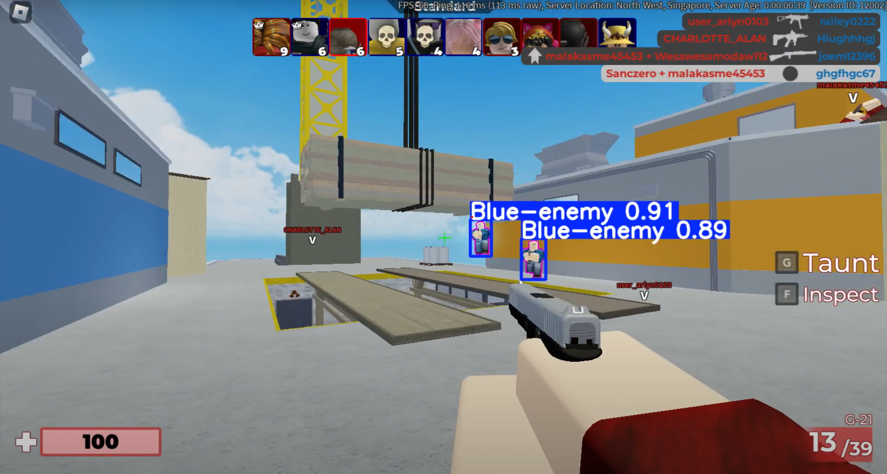

# Aim_Assist_FPS

*This project is purely for testing and fun. Do not use this to cheat in games. We only train and test from our private server.*

## Overview

**Aim_Assist_FPS** leverages **YOLO (You Only Look Once)**, a powerful real-time object detection algorithm, to enhance gameplay by providing auto-aim functionality in First-Person Shooter (FPS) games. The system detects enemies in the player's field of view and automatically adjusts the aim for improved accuracy. The goal of this project is to test and explore the integration of AI in game mechanics for educational and research purposes.

### Key Features:
- **Real-Time Object Detection**: Detects and identifies enemy players or objects in the game world using YOLO.
- **Auto-Aim Assistance**: Automatically adjusts the player's aim to target detected enemies.

## Prerequisites

Before running this project, you need to install the following dependencies:

- Python
- OpenCV
- Ultralytics

## Installation

1. Clone this repository:
   ```bash
   git clone https://github.com/Hancovirus/Aim-Assist-FPS.git
   cd Aim-Assist-FPS
2. Install requirements:
   ```bash
   pip install -r requirements.txt
3. Start Roblox and Arsenal: Open Roblox and start the game Arsenal.
4. Run the Notebook: Open the *RunOnScreen.ipynb* notebook in Jupyter and run the code cells. The notebook will process the game screen and provide auto-aim assistance by detecting enemies using YOLO.

## Preview

1. Preview of the object detection: https://youtu.be/q1EYzm-0Jjo
2. Preview of the auto aim: https://youtu.be/3y_93_FrRds
3. Preview image:
   

